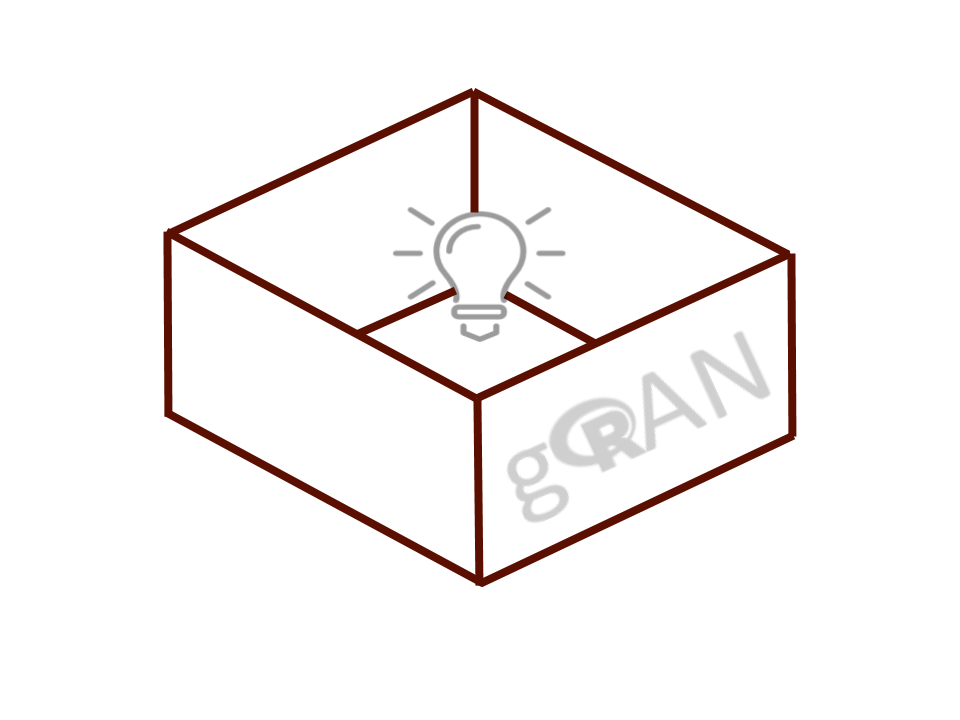

GRANBase
========


[](https://cran.rstudio.com/web/packages/GRANBase/index.html)
[](https://cran.r-project.org/web/packages/GRANBase/GRANBase.pdf)
[](https://travis-ci.org/gmbecker/gRAN)


## Introduction

`GRANBase` is an open source set of tools for testing and deploying R packages as package repositories for both general deployment
and result reproduction. It is based on the [`switchr`](https://cran.r-project.org/package=switchr) framework, and allows users to deploy package manifests as validated repositories.It is centered around the R repository mechanism for package distribution.

`GRANBase` provides three major areas of functionality:

- The ability to create one or more R package repositories by pulling and testing packages from diverse locations (SCM, Git, local directory), in a manner conducive to continuous integration
- Tools for recreating specific environments based on sessionInfos, and for creating lightweight virtual repositories which serve the exact package versions specified in the `sessoinInfo`
- Tools for assessing the potential impact of upgrading a package, to assist administrators in keeping systems up-to-date while protecting reproducibility and comparability of results in long-running core applications

`GRANBase` performs the following steps when creating or updating a repository. At the end of each step, the packages’ statuses are updated to reflect the results of that step:
- Up-to-date copies of package sources are obtained for each package being built, including updating previously checked-out versions
- Packages whose versions have changed since their last successful build, or who are reverse dependencies of such a package, are built without vignettes into a temporary repository via `R CMD build`
- Packages which successfully built, along with their `GRANBase`, CRAN, and Bioconductor-based dependencies are installed into a temporary library location
- Packages which successfully installed are built again, with vignettes, into a staging directory
- Remaining packages are tested via `R CMD CHECK`, and their statuses are updated accordingly
- Packages which meet the requirements set for the repository (`CHECK` warnings and notes can be all owed, or not) are deployed into the final destination repository
- The `GRANBase` manifest is updated to reflect the build results
- An HTML build report is generated from the updated manifest
- The manifest and *GRANRepository* object are saved
- The *GRANRepsitory* object is returned

Please refer to the package reference manual and vignettes for more details on usage.

## Installation

You may install the stable, release version of GRANBase from CRAN like this:
```R
# Install the CRAN Release Version of GRANBase
install.packages("GRANBase")
```

## Contribute

Want to contribute? Great! You can do so by:
- Forking this repo
- Creating a new branch
- Committing changes to that branch
- And finally submitting your changes for review by creating a pull request
