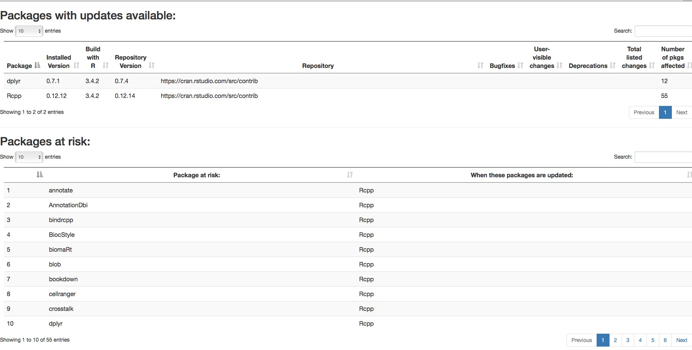

```{r setup, include = FALSE}
knitr::opts_chunk$set(collapse = TRUE, comment = "#>")
```

## Introduction

GRANBase is an open source set of tools for testing and deploying `R` packages as package repositories for both general deployment and result reproduction. It is based on the `switchr` framework, and allows users to deploy package manifests as validated repositories.It is centered around the R repository mechanism for pacakge distribution. GRANBase provides three major areas of functionality:

* The ability to create one or more `R` repositories by pulling and testing packages from diverse locations (scm, local directory), in a manner conducive to continuous integration
* Tools for recreating specific environments based on sessionInfos, and for creating lightweight virtual repositories which serve the exact package versions specified in the sessoinInfo
* Tools for assessing the potential impact of upgrading a package, to assist administrators in keeping systems up-to-date while protecting reproducibility and comparability of results in long-running core applications.

## Creating GRANBase repositories

GRANBase relies on the GRANCore framework for repository management, which in turn is based on package manifests (*PkgManifest* or *SeedingManifest* objects from the `switchr` framework).

Given a manifest, initial construction and rebuilding of individual GRANBase repositories (referred to as _subrepositories_ because GRANBase supports a form of branched deployment) is performed via the `makeRepo` function. For example:

```{r init_granbase, include = FALSE}
suppressPackageStartupMessages(library(GRANBase))
options(error=traceback)
```

```{r makerepo, echo = TRUE, eval = TRUE, results = "hide", warning = FALSE, message = FALSE, error = FALSE}
testpkgs <- list.files(system.file("testpkgs", package = "GRANBase"), 
                       full.names = TRUE)
man <- PkgManifest(name = basename(testpkgs),
                  url = testpkgs, type = "local")
repdir <- file.path(tempdir(), "repos")
if(!file.exists(repdir)) dir.create(repdir)
repo <- makeRepo(man, 
                repo_name= "stable", 
                basedir = repdir, 
                destination = repdir, 
                cores = 1L, 
                install_test = FALSE, 
                check_test = FALSE)
```

*NOTE*: In the above code, we disabled the installation and `R CMD check`-related tests due to not playing well with the CRAN build system. In most cases, these should be `TRUE` in order to create a validated package repository. Also note that in the output below, the `willfail` package appears in the repository. This would not be the case if the check test was turned on, as it is engineered as a test case to fail check.

```{r availpkgs, echo = TRUE, eval = TRUE}
available.packages(repo, type="source")
```

Note that the repository contains the package `GRANstable`. This was generated automatically, and exports a `defaultGRAN()` function which the `switchr` package will use when the package is loaded to incorporate our package into the set of default repositories.

GRANBase represents (sub)repositories as `GRANRepository` objects, which come from the `GRANCore` package. These objects contain all the information required to build and deploy the repository.

Once a repository is created, its `GRANRepository` object is saved within the created directory structure as the `repo.R` file. This allows future builds to be invoked by the simpler syntax of passing a `GRANRepository` object or path to a created repository to `makeRepo()` directly:

```{r makestablerepo, echo = TRUE, eval = FALSE}
repo <- makeRepo(file.path(repdir, "stable"), cores=1L)
```

The `makeRepo()` function also accepts a `build_pkgs` argument, which will cause only the specified packages (and their reverse dependencies) to be rebuilt, regardless of changes in version number.

```{r makestablerepo2, echo = TRUE, eval = FALSE}
repo2 <- makeRepo(repo,
                  build_pkgs = basename(testpkgs)[1], 
                  cores = 1L)
```


## The repository build process

GRANBase performs the following steps when creating or updating a repository. At the end of each step, the packages' statuses are updated to reflect the results of that step.

* Up-to-date copies of package sources are obtained for each package being built, including updating previously checked out versions
* Packages whose versions have changed since their last successful build, or who are reverse dependencies of such a package, are built without vignettes into a temporary repository via `R CMD build`. 
* Packages which successfully built, along with their GRANBase, `CRAN`, and `Bioconductor`-based dependencies, are installed into a temporary library location. 
* Packages which successfully installed are built again, with vignettes, into a staging directory.
* Remaining packages are tested via `R CMD CHECK`, and their statuses are updated accordingly
* Packages which meet the requirements set for the repository (`CHECK` warnings and notes can be all owed, or not) are deployed into the final destination repository
* The GRANBase manifest is updated to reflect the build results
* An HTML build report is generated from the updated manifest
* The manifest and `GRANRepository` object are saved
* The `GRANRepsitory` object is returned


## Tools for managing repository stability

GRANBase also provides tools to navigate the tension between stability and using the most up-to-date version of packages to have the latest bug fixes available.

The `identifyRisk` function identifies which currently installed packages can be updated, and determines the packages that could possibly be affected by updating the package. In particular, the function allows the user to identify a vector of _important_ packages and assesses the risks to each of them (by default, it takes that to be the full set of installed packages).

_Risk_ here has a dual meaning. On the one hand updating a package which an important package depends on incurs the risk of changing the important package's behavior, potentially changing results in a critical application. On the other hand, not updating a such a package may leave important bug fixes un-applied, drawing the results generated when using the important package into question.

`buildRiskReport` builds an HTML report which lists information about each package with an update available in an easy to digest table. It also provides a list of specific risks to each important package (packages with no risks identified are currently omitted).



